# avsdpll_3v3 - OnChip PLL Clock Multiplier 

### Specifications
    - ClockIn  5MHz  to 12MHz  at 1.8v
    - ClockOut 40MHz to 100MHz at 1.8v
    - 8x multiplication

This repository hosts relevant files on the IP.

## 1. Contents
00. [Specifications](https://github.com/eddygta17/avsdpll_3v3/tree/master/00.Specifications) - Specifications provided for the PLL.
01. [Reports](https://github.com/eddygta17/avsdpll_3v3/tree/master/01.Reports) - Reports and presentations.
02. [Schematic](https://github.com/eddygta17/avsdpll_3v3/tree/master/02.Schematic) - Schematic of different components.
03. [Layout](https://github.com/eddygta17/avsdpll_3v3/tree/master/03.Layout) - Layout of different components.
04. [Misc](https://github.com/eddygta17/avsdpll_3v3/tree/master/04.Misc) - Images

## 2. Pre-layout Simulation of PLL 
1. Input Frequency (F_in) = 5MHz
#### Locking in
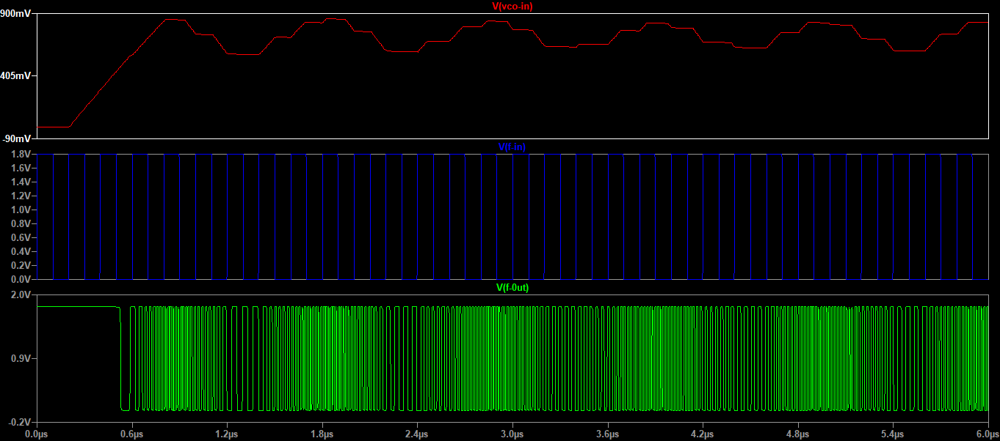
#### 8x clock
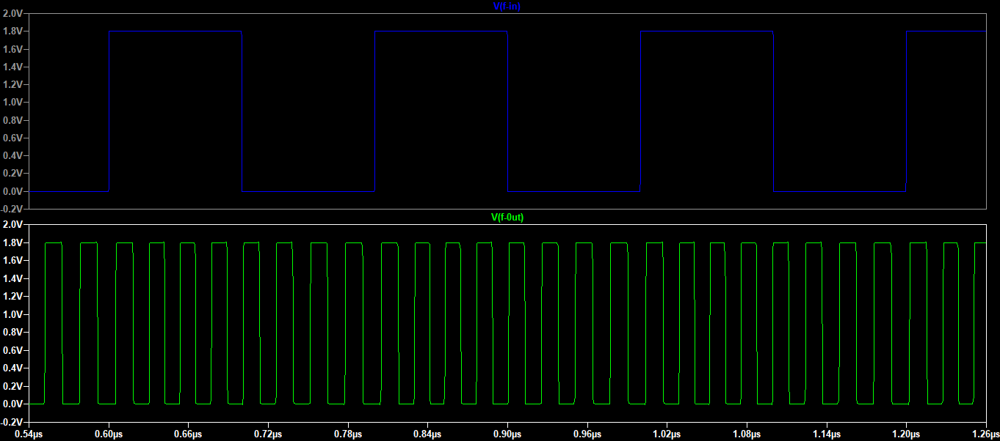
2. Input Frequency (F_in) = 10MHz
#### Locking in
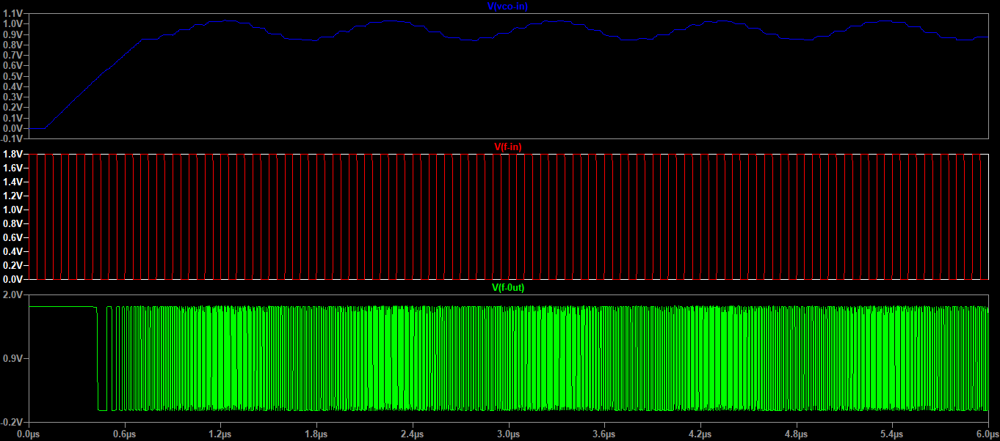
#### 8x clock
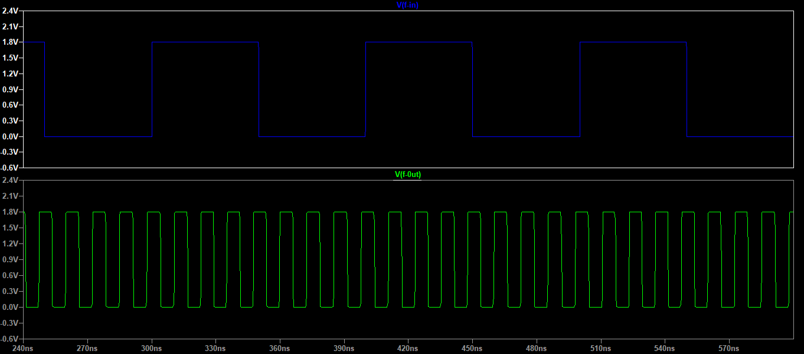

## 3. Layout
### PFD
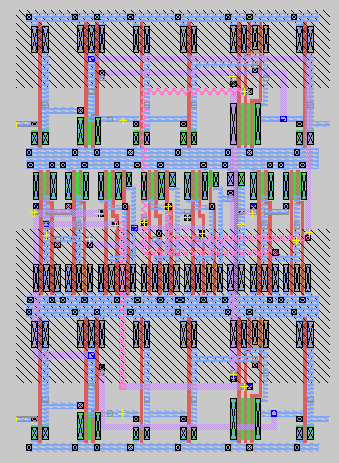
### VCO
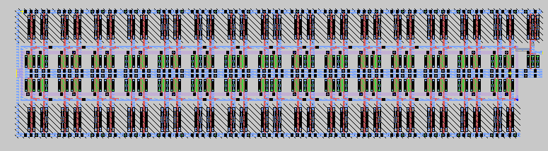
### DIV2
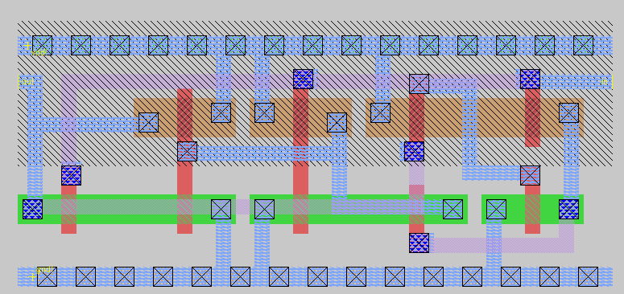
### DIV8
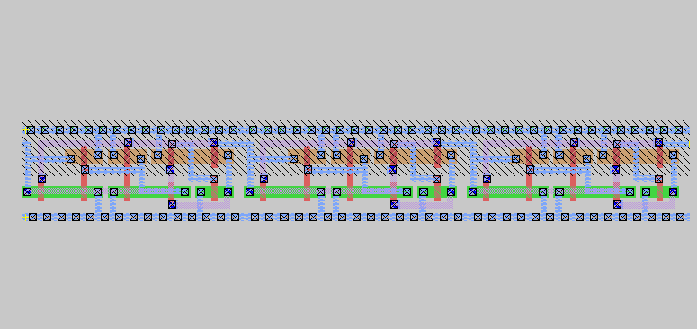

__Due to the limitaions of OSU180 the chargepump layout was not made.__

## 4. Post-layout Simulation of PLL 
1. Input Frequency (F_in) = 5MHz
#### Locking in

#### 8x clock
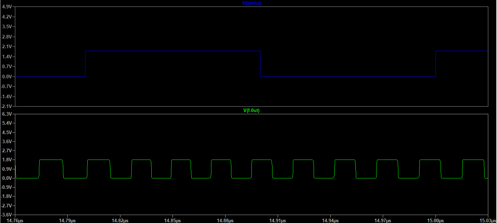
2. Input Frequency (F_in) = 10MHz
#### Locking in
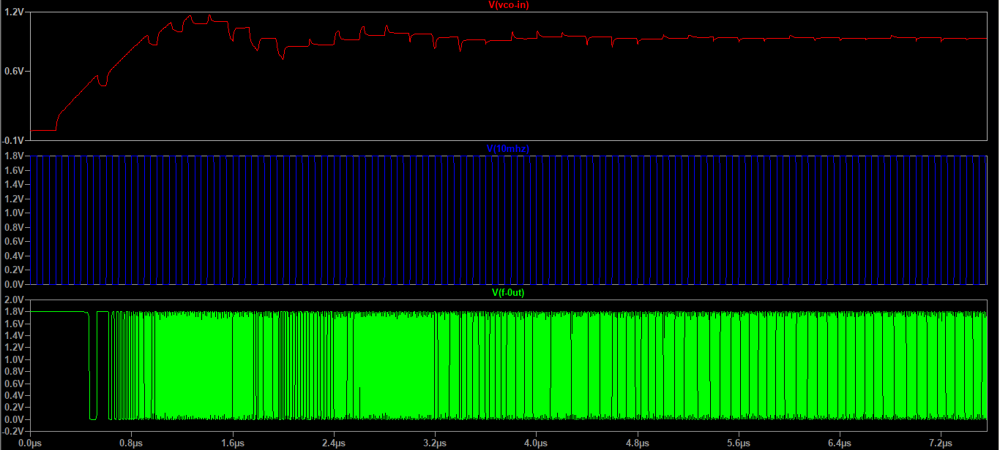
#### 8x clock
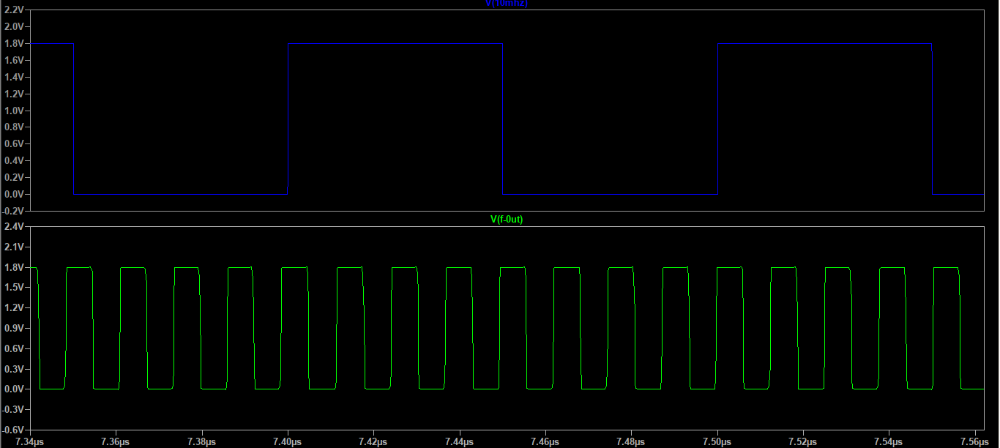

## 6. Tools Used

1. [Ngspice](http://ngspice.sourceforge.net/download.html)
2. [magic](http://opencircuitdesign.com/magic/)

## 7. Future work

1. Porting this IP to SKY130.
2. Improve area efficiency.
3. Add biasing current.
4. Improve jitter and lock in time.

## 8. Author
- Abel Joseph John, B.Tech in ECE, NSS College of Engineering, Palakkad

## 9. Acknowledgments & Thanks
- Kunal Promode Ghosh, for mentoring and guidance.
- Philipp Gühring, for helping out with tools.
- R. Timothy Edwards, for creating awesome OpenSource tools.
- Prof. R Jacob Baker, for his textbook on CMOS design.

